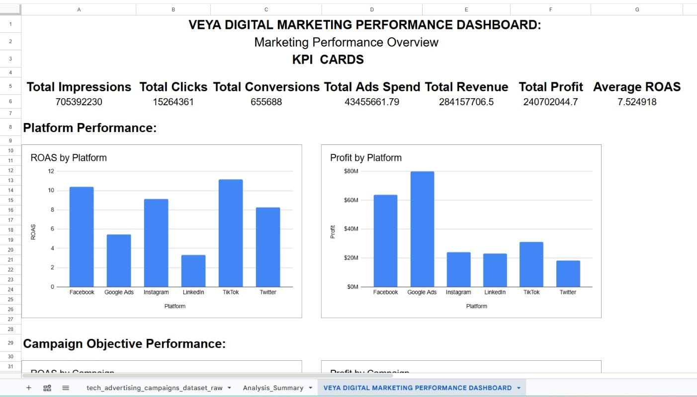
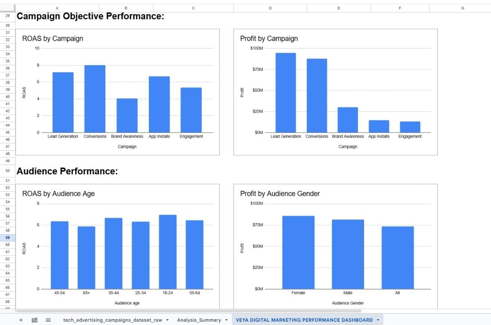
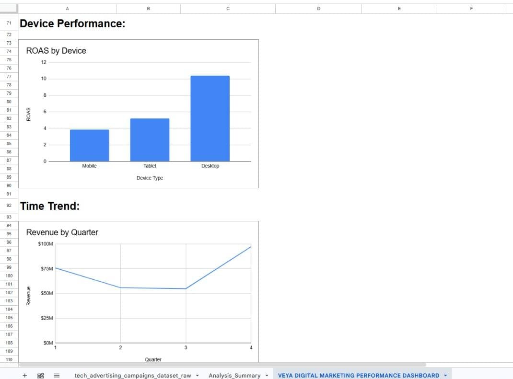
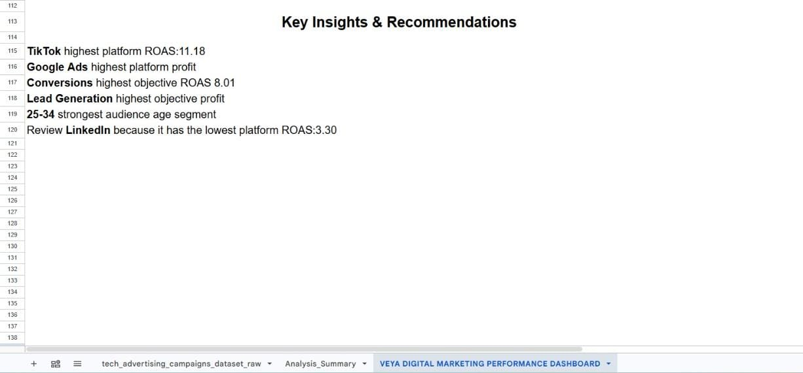

# Veya Marketing Analytics

📊 **End-to-End Marketing Campaign Analysis**

This project is an end-to-end marketing analytics case study focused on analyzing technology advertising campaign data and turning raw campaign data into actionable business insights.

The project covers the complete analytics workflow:

`Raw Data` → `Data Cleaning` → `Processed Data` → `Excel` → `SQL` → `Python` → `Power BI` → `Business Insights`

---

## 🎯 Business Objective

The main objective of this project is to evaluate advertising campaign performance and identify the factors that influence revenue, conversions, profit, ROAS, and overall marketing effectiveness.

The analysis focuses on questions such as:
* Which platforms perform best?
* Which campaigns generate the highest profit?
* Which campaigns achieve the best ROAS?
* Which audience segments perform best?
* How do devices and operating systems affect performance?
* Does retargeting improve conversions?
* Which creative formats perform best?
* Which ad placements generate the most revenue?
* Which days and hours show stronger conversion performance?
* Which areas should marketers prioritize for optimization?

---

## 📁 Project Structure

```text
veya_marketing-analytics/
│
├── 01_case_study/
│   └── case_study.md
│
├── 02_data/
│   ├── raw/
│   └── processed/
│
├── 03_Excel_Analysis/
│   ├── 01_dashboard_kpis_and_platform.jpeg
│   ├── 02_dashboard_campaign_and_audience.jpeg
│   ├── 03_dashboard_device_and_trends.jpeg
│   ├── 04_dashboard_recommendations.jpeg
│   ├── 05_summary_kpi_platform_campaign.jpeg
│   ├── 06_summary_demographics_and_devices.jpeg
│   ├── 07_summary_creative_and_placement.jpeg
│   ├── 08_summary_insights_part1.jpeg
│   └── 09_summary_insights_part2.jpeg
│
├── 04_python/
│   ├── veya_marketing_analysis.ipynb
│   └── veya_marketing_analysis.py
│
├── 05_SQL/
│   └── veya_marketing_analysis.sql
│
├── 06_Power_Bi/
│   ├── 01_executive_overview.jpeg
│   ├── 02_platform_campaign_performance.jpeg
│   ├── 03_audience_device_analysis.jpeg
│   └── 04_time_creative_placement_analysis.jpeg
│
└── README.md

```
## 🧹 Data Cleaning & Preparation

The raw advertising campaign dataset was processed before performing the analysis.

The data preparation included:
- Removing unnecessary fields
- Removing unnecessary CPC data where applicable
- Using `TRIM` to remove unwanted spaces
- Checking for blank values
- Standardizing text values
- Standardizing operating system names:
- Replacing `iOS` with `IOS`
- Replacing `macOS` with `MacOS`
- Checking the dataset for consistency
- Creating the final processed dataset for analysis

The cleaned dataset was then used for the Excel, SQL, Python, and Power BI stages.

## 📗 Excel Analysis

Excel was used for initial data analysis, KPI calculations, summaries, and dashboard development.

### Key KPIs
- Impressions
- Clicks
- CTR
- Conversions
- Conversion Rate
- Ad Spend
- Revenue
- Profit
- CPA
- ROAS

### Analysis Covered
- Platform performance
- Campaign performance
- Audience analysis
- Demographic analysis
- Device performance
- Operating system performance
- Creative performance
- Ad placement performance
- Time-based trends
- Campaign recommendations

The Excel analysis was used to identify important trends and prepare the findings for deeper analysis.


## 🗄️ SQL Analysis

SQL was used to analyze the processed marketing campaign dataset and answer business questions using structured queries.

The SQL analysis includes areas such as:
- Overall campaign performance
- Platform performance
- Campaign performance
- Revenue and profit analysis
- ROAS analysis
- CPA analysis
- Audience performance
- Device performance
- Operating system performance
- Creative format performance
- Ad placement performance
- Time-based performance
- High-performing and low-performing campaigns

SQL helped transform the processed data into meaningful analytical results.


## 🐍 Python Analysis

Python was used for data analysis, KPI calculations, segmentation, and deeper exploration of campaign performance.

The Python analysis is available in two formats:
- `marketing_analysis.ipynb` — Jupyter Notebook version
- `marketing_analysis.py` — Python script version

### Analysis Included
- Data loading and inspection
- Data cleaning checks
- KPI calculations
- Platform analysis
- Campaign analysis
- Audience analysis
- Device analysis
- Operating system analysis
- Retargeting analysis
- Creative format analysis
- Ad placement analysis
- Time-based analysis
- ROAS analysis
- Profitability analysis
- Campaign performance comparisons

The notebook provides an interactive analysis workflow, while the `.py` file provides the analysis as a reusable Python script.


## 📊 Power BI Dashboard

Power BI was used to create the final interactive marketing analytics dashboard.

The dashboard contains four main pages:

1. **Executive Overview**  
   Provides a high-level summary of marketing performance. It focuses on key metrics and overall campaign performance to help stakeholders quickly understand the results.

2. **Platform & Campaign Performance**  
   Focuses on platform performance, campaign performance, revenue, profit, ROAS, CPA, and campaign comparisons. Helps identify which platforms and campaigns contribute most strongly to marketing performance.

3. **Audience & Device Analysis**  
   Analyzes Profit by Age, Profit by Gender, Conversions by Purchase Intent, Conversions by Retargeting Flag, Profit by Device Type, ROAS by Operating System, and Conversions by Device Type. Interactive filters allow the audience to explore different gender and age segments.

4. **Time, Creative & Placement Analysis**  
   Analyzes Revenue by Quarter, Profit by Creative Format, Revenue by Ad Placement, Conversions by Day, and Performance by Hour. Interactive filters allow analysis by Quarter, Creative Format, and Ad Placement.


## 📸 Power BI Dashboard Screenshots

### Executive Overview


### Platform & Campaign Performance


### Audience & Device Analysis


### Time, Creative & Placement Analysis


---

## 📸 Excel Analysis Screenshots

### Dashboard — KPIs & Platform


### Dashboard — Campaign & Audience


### Dashboard — Device & Trends


### Dashboard — Recommendations



## 💡 Key Analytical Areas

The project evaluates marketing performance across multiple dimensions:

- **Platform**: Identifying platforms that generate stronger revenue, profit, conversions, and ROAS.
- **Campaign**: Comparing individual campaigns to identify high-performing and underperforming campaigns.
- **Audience**: Evaluating demographic groups, purchase intent, and retargeting behavior.
- **Device & Operating System**: Understanding how performance differs between desktop, mobile, and tablet users and across operating systems.
- **Creative**: Comparing formats such as Video, Image, Carousel, Interactive, Story, and Text.
- **Placement**: Comparing Feed, Stories, Search, Display Network, Sidebar, and In-Stream Video.
- **Time**: Analyzing performance by Quarter, Day of week, and Hour of day.

---

## 📌 Marketing KPIs

| KPI | Meaning |
| :--- | :--- |
| **CTR** | Click-through rate |
| **Conversion Rate** | Percentage of clicks resulting in conversions |
| **CPA** | Cost per acquisition |
| **ROAS** | Revenue generated relative to advertising spend |
| **Revenue** | Revenue generated by campaigns |
| **Profit** | Revenue after advertising spend |
| **Impressions** | Number of times ads were displayed |
| **Clicks** | Number of ad clicks |
| **Conversions** | Number of completed conversions |

---

## 🔄 End-to-End Workflow

```text
Raw Data
   ↓
Data Cleaning & Preparation
   ↓
Processed Data
   ↓
Excel Analysis
   ↓
SQL Analysis
   ↓
Python Analysis
   ↓
Power BI Dashboard
   ↓
Insights & Recommendations

```
## 🛠️ Tools & Technologies

- **Microsoft Excel** — Data analysis, KPI calculations, dashboards
- **MySQL** — SQL querying and analytical analysis
- **Python** — Data analysis and exploration
- **Pandas** — Data manipulation
- **Jupyter Notebook** — Interactive Python analysis
- **Power BI** — Interactive dashboards and visualization
- **GitHub** — Project documentation and version control

---

## 🎯 Project Outcome

This project demonstrates a complete marketing analytics workflow from raw data to business intelligence.

The combination of Excel, SQL, Python, and Power BI provides multiple analytical perspectives and demonstrates the ability to:
- Clean and prepare marketing data
- Calculate and interpret marketing KPIs
- Analyze campaign performance
- Segment customers and audiences
- Identify performance trends
- Compare platforms, devices, creatives, and placements
- Build interactive dashboards
- Translate analytical findings into business recommendations

---

## 👤 Author

**Maham Mehboob**  
Marketing Analytics Portfolio Project
```

